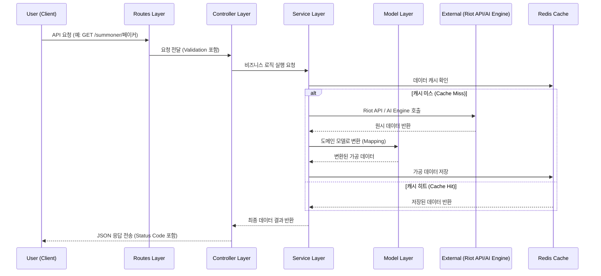

# 시스템 아키텍처 — SOWJS.KR

> 확정된 기술 스택 기반의 AWS 인프라 및 서비스 간 통신 구조를 정의합니다.

---

## 🏗️ 전체 아키텍처 다이어그램

```
┌─────────────────────────────────────────────────────────────────┐
│                        USERS (Browser)                          │
└──────────────────────────────┬──────────────────────────────────┘
                               │ HTTPS
                               ▼
┌─────────────────────────────────────────────────────────────────┐
│                    Vercel Edge Network                          │
│              Next.js Frontend + Global CDN + SSL                │
└──────────────────────────────┬──────────────────────────────────┘
                               │
          ┌────────────────────┴────────────────────┐
          │                                         │
          ▼                                         ▼
┌─────────────────┐                        ┌──────────────────┐
│  EC2 Instance 1 │                        │  EC2 Instance 2  │
│                 │                        │                  │
│  [BACKEND BFF]  │                        │  [AI/ML ENGINE]  │
│  Node.js        │                        │  Python          │
│  Fastify        │                        │  FastAPI         │
│  TypeScript     │                        │  scikit-learn    │
│  Port: 4000     │                        │  Port: 8000      │
└────────┬────────┘                        └────────┬─────────┘
         │                                          │
         │         ┌─────────┴──────────┐           │
         │         │                    │           │
         │         ▼                    ▼           │
         │  ┌─────────────┐    ┌──────────────┐    │
         │  │  AWS RDS    │    │  AWS         │    │
         │  │ PostgreSQL  │    │  ElastiCache │    │
         │  │             │    │  (Redis)     │    │
         │  └─────────────┘    └──────────────┘    │
         │                                         │
         └───────────────────────────────────────→ │
                    Internal HTTP (VPC)             │
                                                   ▼
                                         ┌──────────────────┐
                                         │   Riot Games API │
                                         │   (External)     │
                                         └──────────────────┘
```

---

## 🖥️ 인스턴스별 역할 상세

### Frontend (Vercel)

| 항목 | 내용 |
|------|------|
| **플랫폼** | Vercel |
| **프레임워크** | Next.js 14+ (App Router) |
| **언어** | TypeScript |
| **UI** | Tailwind CSS + shadcn/ui |

**주요 역할**
- SSR: 전적 검색 페이지 (SEO 중요)
- CSR: 팀 구성 입력/결과 페이지 (인터랙션 중심)
- Static: 메타 분석, 챔피언 정보 (빌드 시 생성)
- Backend BFF(Instance 1)와 REST API 통신
- Edge Network를 통한 글로벌 CDN 및 SSL 자동화

**페이지 렌더링 전략**

| 페이지 | 전략 | 이유 |
|--------|------|------|
| `/` 메인 | SSG | 정적 콘텐츠 |
| `/summoner/[name]` 전적 검색 | SSR | SEO + 실시간 데이터 |
| `/custom-game` 팀 구성 | CSR | 복잡한 인터랙션 |
| `/meta` 메타 분석 | ISR (1시간) | 패치 주기 반영 |

---

### Instance 1 — Backend BFF (Node.js + Fastify)

| 항목 | 내용 |
|------|------|
| **런타임** | Node.js 20 LTS |
| **프레임워크** | Fastify |
| **언어** | TypeScript |
| **포트** | 4000 |
| **추천 사양** | t3.medium (초기) |

**주요 역할**
- Riot API 호출 및 Rate Limit 관리
- Redis 캐싱 레이어 (API 응답 1시간 캐시)
- AI 엔진(Instance 3)과 내부 HTTP 통신
- JWT 기반 인증/인가 (추후 로그인 기능 시)
- PostgreSQL 데이터 CRUD

**API 엔드포인트 (초안)**

```
GET  /api/summoner/:name          → 소환사 기본 정보
GET  /api/summoner/:name/matches  → 최근 매치 목록
GET  /api/summoner/:name/stats    → 히든 MMR용 통계 데이터
POST /api/custom-game/balance     → 팀 밸런싱 요청 (AI 엔진 호출)
GET  /api/meta/champions          → 메타 챔피언 정보
GET  /api/health                  → 헬스체크
```

**Riot API Rate Limit 전략**
```
Development Key: 20 req/s, 100 req/2min
Production Key:  요청 필요 (Riot 심사)

전략:
1. Redis 캐싱으로 중복 호출 최소화
2. 요청 큐(Queue)로 Rate Limit 초과 방지
3. 캐시 미스 시에만 실제 API 호출
```

---

### Instance 2 — AI/ML Engine (Python + FastAPI)

| 항목 | 내용 |
|------|------|
| **런타임** | Python 3.11+ |
| **프레임워크** | FastAPI |
| **라이브러리** | scikit-learn, numpy, pandas |
| **포트** | 8000 |
| **추천 사양** | t3.medium (초기) |

**주요 역할**
- 유저 통계 데이터 수신 → 히든 MMR 산출
- 10명 유저 데이터 수신 → 최적 팀 구성 알고리즘 실행
- 내부 VPC 통신만 허용 (외부 직접 접근 차단)

**API 엔드포인트**

```
POST /mmr/calculate       → 단일 유저 히든 MMR 산출
POST /team/balance        → 10명 팀 밸런싱 최적화
GET  /health              → 헬스체크
```

**팀 밸런싱 알고리즘 흐름**
```python
# 입력: 10명의 유저 데이터 (MMR, 포지션)
# 출력: 최적 팀 구성 Top 3

1. C(10,5) = 252가지 조합 생성
2. 포지션 제약 조건 필터링
   - 각 팀에 TOP/JG/MID/ADC/SUP 1명씩
   - 주 라인 우선, 부 라인 차선
3. 각 조합의 MMR 합산 차이 계산
4. 차이가 가장 작은 Top 3 조합 반환
5. 예상 승률 계산 (MMR 차이 → 승률 변환)
```

---

## 🗄️ 데이터베이스 설계 (초안)

### AWS RDS — PostgreSQL

```sql
-- 소환사 캐시 테이블
CREATE TABLE summoners (
  id          UUID PRIMARY KEY DEFAULT gen_random_uuid(),
  puuid       VARCHAR(100) UNIQUE NOT NULL,
  name        VARCHAR(50) NOT NULL,
  server      VARCHAR(10) NOT NULL,  -- KR, NA, EUW...
  tier        VARCHAR(20),
  rank        VARCHAR(5),
  lp          INTEGER,
  hidden_mmr  FLOAT,
  updated_at  TIMESTAMP DEFAULT NOW()
);

-- 내전 기록 테이블
CREATE TABLE custom_games (
  id          UUID PRIMARY KEY DEFAULT gen_random_uuid(),
  created_at  TIMESTAMP DEFAULT NOW(),
  team_a      JSONB NOT NULL,  -- 팀 A 구성
  team_b      JSONB NOT NULL,  -- 팀 B 구성
  balance_score FLOAT,         -- 밸런스 점수 (낮을수록 균형)
  share_token VARCHAR(20) UNIQUE  -- 결과 공유용 토큰
);
```

### AWS ElastiCache — Redis

```
Key 패턴:
summoner:{puuid}:info       → 소환사 기본 정보 (TTL: 1h)
summoner:{puuid}:matches    → 최근 매치 목록 (TTL: 1h)
summoner:{puuid}:stats      → 통계 데이터 (TTL: 1h)
meta:champions:{patch}      → 메타 챔피언 정보 (TTL: 24h)
```

---

## 🔒 보안 설계

| 항목 | 전략 |
|------|------|
| **VPC** | 2개 인스턴스 동일 VPC 내 배치, AI 엔진은 내부 통신만 허용 |
| **Security Group** | Backend: Vercel/Public에서 4000 허용, AI: Backend에서만 8000 허용 |
| **Riot API Key** | 환경변수로 관리, 코드에 하드코딩 금지 |
| **HTTPS** | Vercel (Managed SSL), Backend (AWS ALB/Nginx SSL) |
| **Rate Limiting** | Fastify rate-limit 플러그인으로 API 남용 방지 |

---

### 초기 (MVP)
```
Vercel (Free/Pro)  → Frontend (Next.js)
EC2 t3.medium × 1  → Backend BFF (Node.js)
EC2 t3.medium × 1  → AI Engine (Python)
RDS db.t3.micro    → PostgreSQL
ElastiCache t3.micro → Redis
```

### 성장기 (트래픽 증가 시)
```
Vercel Enterprise  → 프론트엔드 확장
Auto Scaling Group → Backend, AI Engine 수평 확장
RDS Read Replica   → 읽기 부하 분산
```

---

## 🔄 서비스 간 통신 흐름

### 팀 구성 요청 흐름

```
1. 유저가 10명 소환사명 입력 (Frontend)
2. Frontend → Backend BFF: POST /api/custom-game/balance
3. Backend BFF → Redis: 각 소환사 캐시 확인
4. 캐시 미스 → Backend BFF → Riot API: 매치 데이터 수집
5. Backend BFF → AI Engine: POST /team/balance (통계 데이터 전송)
6. AI Engine: 히든 MMR 산출 + 팀 밸런싱 알고리즘 실행
7. AI Engine → Backend BFF: 팀 구성 결과 반환
8. Backend BFF → PostgreSQL: 내전 기록 저장
9. Backend BFF → Frontend: 최종 결과 반환
10. Frontend: 팀 구성 결과 렌더링
```

### 전적 검색 흐름

```
1. 유저가 소환사명 검색 (Frontend)
2. Next.js SSR: Backend BFF에 데이터 요청
3. Backend BFF → Redis: 캐시 확인
4. 캐시 히트 → 즉시 반환 (캐시 미스 → Riot API 호출)
5. Frontend: 전적 정보 렌더링
```

---

## 🏗️ 백엔드 상세 아키텍처 (Extended MVC)

SOWJS.KR 백엔드는 확장된 **MVC(Model-View-Controller)** 패턴을 사용합니다. 코드의 유지보수성과 확장성을 높이기 위해 Controller 레이어에서 비즈니스 로직을 분리한 **Service 레이어**를 추가한 것이 특징입니다.

### 레이어별 역할

| 레이어 | 위치 | 역할 |
| :--- | :--- | :--- |
| **Routes** | `src/routes/` | HTTP 경로 정의 및 Swagger 문서 스키마 설정 |
| **Controllers** | `src/controllers/` | 요청 파라미터 추출, 서비스 호출 및 응답(JSON) 제어 |
| **Services** | `src/services/` | **핵심 비즈니스 로직** (MMR 계산, 알고리즘 제어, 외부 API 호출 흐름) |
| **Models** | `src/models/` | 데이터 전송 객체(DTO) 정의 및 내부 도메인 인터페이스 |
| **Utils** | `src/utils/` | Riot API 클라이언트, Redis 캐시 등 공통 유틸리티 |
| **Config** | `src/config/` | 환경 변수 관리 및 중앙 집중식 설정 |

### 🔄 요청 처리 흐름 다이어그램



---

## 📌 관련 문서

- [아이디어 개요](./idea-overview.md)
- [요구사항 명세](./requirements.md)
- [API 명세서](./api-spec.md)
- [Riot API 레퍼런스](./riot-api-reference.md)
